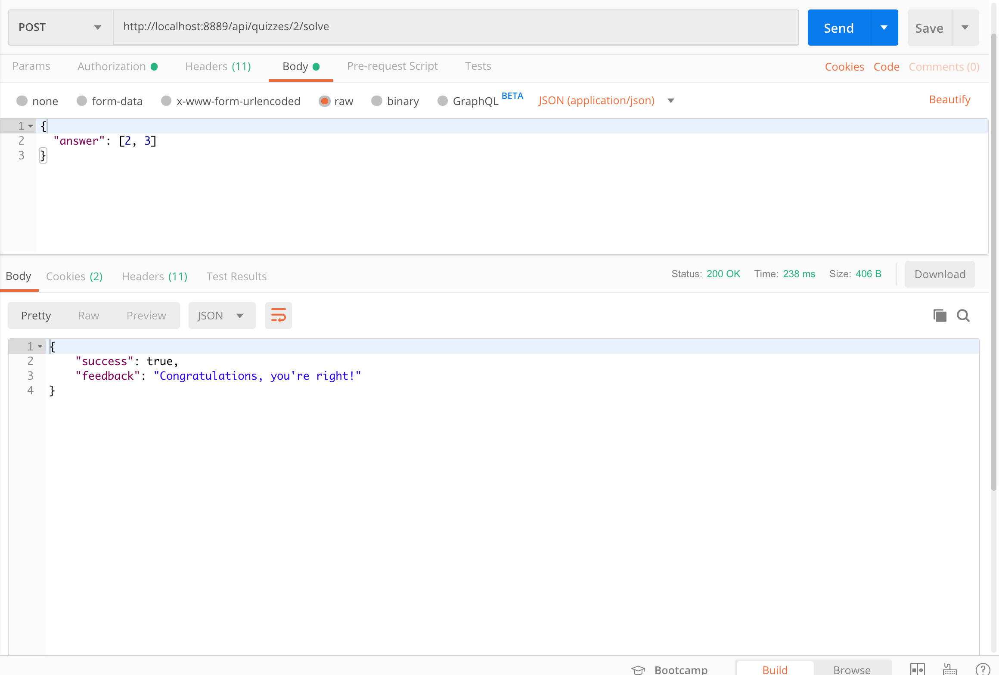

# WebQuizEngine

> Jetbrains Academy – Web Quiz Engine project        

## About

In the Internet, you can often find sites where you need to answer some  questions. It can be educational sites, sites with psychological tests, job search services, or just entertaining sites like web quests. The  common thing for them is the ability to answer questions (or quizzes)  and then see some results. In this project, you will develop a  multi-users web service for creating and solving quizzes.

## Registration

## Quiz addition

## Quiz solution

## Meta

Distributed under the GPL-3.0 license. See ``LICENSE`` for more information.

[@limitedeternity](https://github.com/limitedeternity)